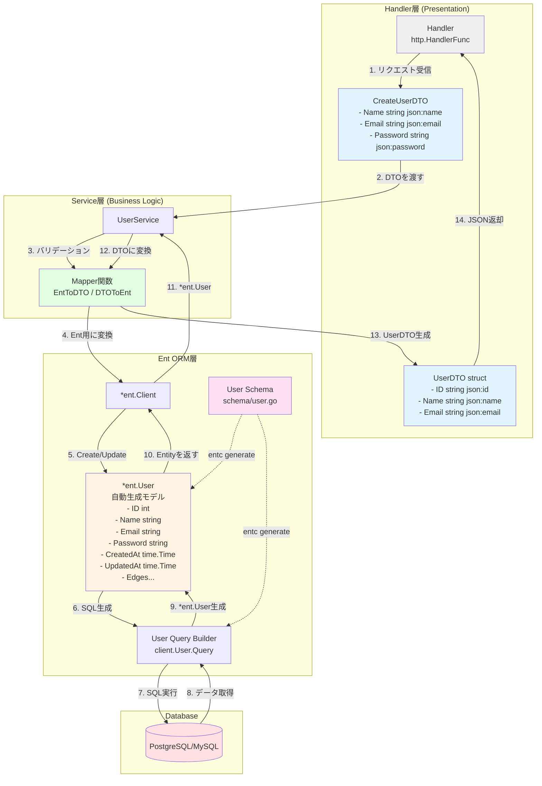

# DTO Pattern

DTOパターンを図で説明しますね。DTOパターンを図にしました。重要なポイントを説明します：

## DTOパターンの目的

**DTO (Data Transfer Object)** は、異なる層の間でデータを運ぶための専用オブジェクトです。

## 主な特徴

**1. データの分離**
- **Entity**: データベースの構造を表現（内部情報を含む）
- **DTO**: 外部に公開する情報のみ含む（パスワードなど秘密情報を除外）

**2. 利点**
- セキュリティ向上（機密情報の漏洩防止）
- 疎結合（内部構造の変更が外部に影響しない）
- ネットワーク効率化（必要なデータのみ転送）
- API契約の明確化

**3. 使用例**

```text
Entity（内部）: 
- password, createdAt, updatedAt など全てのフィールド

DTO（外部公開）: 
- id, name, email など公開して良いフィールドのみ
```

この分離により、データベース構造を変更してもAPIの互換性を保ちやすくなります。



Go EntでのDTOパターンの実装例を図にしますね。Go EntでのDTOパターンを図にしました！

## Go Entの特徴

**1. Entの自動生成**
- `schema/user.go`でスキーマ定義
- `entc generate`で`*ent.User`モデルと Query Builder を自動生成
- 型安全なクエリビルダーが使える

**2. DTOとの使い分け**

```go
// スキーマ定義 (schema/user.go)
type User struct {
    ent.Schema
}

// 自動生成される Ent モデル
type User struct {
    ID        int
    Name      string
    Email     string
    Password  string  // 🔒 外部に公開したくない
    CreatedAt time.Time
    UpdatedAt time.Time
}

// 手動で作成する DTO
type UserDTO struct {
    ID    string `json:"id"`
    Name  string `json:"name"`
    Email string `json:"email"`
    // Passwordは含めない！
}
```

**3. Mapper関数の例**

```go
// Ent → DTO
func EntToDTO(u *ent.User) UserDTO {
    return UserDTO{
        ID:    strconv.Itoa(u.ID),
        Name:  u.Name,
        Email: u.Email,
    }
}

// DTO → Ent (Create時)
func CreateUser(ctx context.Context, dto CreateUserDTO) (*ent.User, error) {
    return client.User.Create().
        SetName(dto.Name).
        SetEmail(dto.Email).
        SetPassword(hashPassword(dto.Password)).
        Save(ctx)
}
```

Entは内部のデータ管理に特化し、DTOは外部とのやり取りに特化させることで、安全で保守性の高いコードになります。
